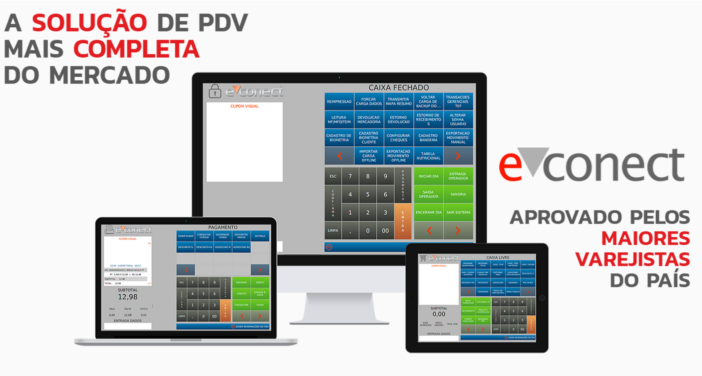

<h1 align="center">
    
</h1>

## 💻 Sobre o projeto

O e-conect é o software de PDV da Socin uma Solução para frente de loja preparada para atender as necessidades varejistas dos mais diferentes portes.

Além dos módulos naturais existentes em uma solução de frente de caixa, o e-conect possui diversas funcionalidades que ajudarão sua empresa a se destacar no mercado.Confira alguns benefícios:
- Vai além do básico e tradicional: Possui Concentrador WEB, PDV Touch e PDV Móvel.
- Capaz de atender desde uma única loja até grandes redes varejistas;
- Possibilidade de adequar a solução para atender necessidades específicas;
- Integrado com a maioria de ERPs disponíveis do mercado;
- Baixo custo de investimento e manutenção.

## 🛠 Tecnologias

As seguintes ferramentas foram usadas na construção do projeto:

- Java
- Spring
- MySQL

## 🚀 Como executar o projeto

### Pré-requisitos

Antes de começar, você vai precisar ter instalado em sua máquina as seguintes ferramentas:
Java JDK 1.8, MySQL 5.7, FTP e SSH
Além disto é bom ter um editor para trabalhar com o código como Eclipse

### 🎲 Rodando o Projeto

🚧 Em construção... 🚧

## 😯 Como contribuir para o projeto

1. Faça um **fork** do projeto.
2. Crie uma nova branch com as suas alterações: `git checkout -b my-feature`
3. Salve as alterações e crie uma mensagem de commit contando o que você fez: `git commit -m "feature: My new feature"`
4. Envie as suas alterações: `git push origin my-feature`
> Caso tenha alguma dúvida confira este [guia de como contribuir no GitHub](https://github.com/firstcontributions/first-contributions)

## 📝 Licença

Este projeto esta sobe a licença MIT.

